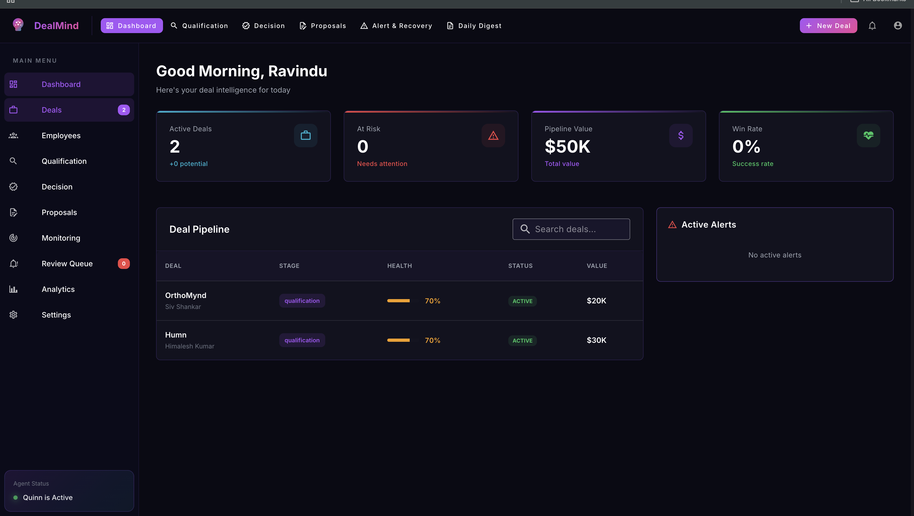

# DealMind Frontend

**AI-Powered Deal Intelligence Platform — Frontend**

Built with Vue 3 + Vuetify 3 + Vite for the **Agentic AI Hackathon 2026** by ESSHVA's Hallucination Squad.

---

## Quick Start

### Prerequisites

- Node.js 18+
- npm or yarn
- Backend API running at `http://localhost:8000` (see `dealmind-backend/README.md`)

### Installation

```bash
cd dealmind-frontend
npm install
```

### Run Development Server

```bash
npm run dev
```

The app will be available at `http://localhost:5173`.

### Build for Production

```bash
npm run build
npm run preview  # preview production build
```

---

## Application Screens

| Screen | Route | Description |
|--------|-------|-------------|
| **Login** | `/login` | Email/password authentication with register option |
| **Dashboard** | `/dashboard` | Pipeline overview — active deals, health scores, alerts, win rate |
| **Qualification** | `/qualification` | Upload RFP documents, run AI qualification (5-step agent) |
| **Decision** | `/decision` | GO/NO-GO recommendation, team auto-assignment, cost analysis |
| **Proposals** | `/proposals` | Review AI-generated proposals, export branded DOCX (3 templates) |
| **Alerts** | `/alerts` | Risk monitoring, sentiment gauge, recovery email editor + Gmail send |
| **Employees** | `/employees` | Team roster management, bulk Excel upload, skill tracking |
| **Daily Digest** | `/digest` | Daily intelligence summary — urgent, follow-up, opportunity columns |
| **Settings** | `/settings` | Gmail OAuth connection, integration health status |

---

## Architecture

```
src/
├── main.js                    # Vue app init, Vuetify dark theme setup
├── App.vue                    # Root: navbar, sidebar, new deal dialog, notifications
├── style.css                  # Global styles, scrollbar, glow effects, animations
│
├── api/
│   ├── client.js              # Axios instance with JWT interceptors (auto 401 redirect)
│   └── index.js               # All API endpoint definitions (11 modules)
│
├── router/
│   └── index.js               # Route definitions with auth guards
│
├── stores/
│   ├── auth.js                # Authentication composable (login, register, JWT persist)
│   └── agentTasks.js          # Singleton agent task polling store (3 flow types)
│
├── views/
│   ├── LoginView.vue          # Login / Register with animated gradient background
│   ├── DashboardView.vue      # Pipeline overview with stat cards + deal table
│   ├── QualificationView.vue  # Document upload + 5-step AI qualification stepper
│   ├── DecisionView.vue       # GO/NO-GO card, team assignment, proposal progress + cancel
│   ├── ProposalsView.vue      # Proposal viewer, compliance score, DOCX template selector
│   ├── AlertsView.vue         # Adaptive positive/negative alert UI, recovery email editor
│   ├── EmployeesView.vue      # Team roster with Excel upload + skill chips
│   ├── DigestView.vue         # Daily summary with priority columns
│   └── SettingsView.vue       # Gmail OAuth + integration health
│
├── plugins/
│   └── vuetify.js             # Vuetify 3 initialization with custom dark theme
│
└── data/
    └── mockData.js            # Sample data for development
```

---

## State Management

DealMind uses a **singleton composable pattern** (not Vuex/Pinia) for lightweight, reactive global state:

### `useAuth()` — Authentication Store

Manages user session with JWT tokens persisted in `localStorage`.

- `login(email, password)` — Authenticate and store token
- `register(email, password, fullName)` — Create account
- `logout()` — Clear session and redirect to login
- `fetchUser()` — Refresh user profile from API

### `useAgentTasks()` — Agent Task Polling Store

Tracks the three AI agent flows across route changes with automatic polling:

| Flow | Steps | Polling |
|------|-------|---------|
| Qualification | ingest → extract → analyze → match → decide | 2s interval |
| Proposal | retrieve → generate → comply | 2s interval |
| Monitoring | sentiment → health → alert → recovery | 2s interval |

- `startTask(dealId, flowType, onComplete)` — Launch agent flow
- `clearTask(flowType)` — Cancel and reset (used by proposal cancel button)
- `resumePolling(flowType)` — Resume on component re-mount
- Safety timeout: 5 minutes per task

---

## Key Features

### Real-Time Agent Progress

Agent tasks show live step-by-step progress via WebSocket (`ws://localhost:8000/ws/agent/{task_id}`) with HTTP polling fallback. Each step updates the UI with status indicators and human-readable messages.

### Adaptive Alert UI

The AlertsView dynamically switches between positive (green, "DEAL LOOKING GOOD") and negative (red, "DEAL AT RISK") styling based on sentiment analysis results — card gradients, headers, icons, and text all respond to the `isPositiveAlert` computed property.

### Proposal Generation with Cancel

The proposal progress dialog shows Retrieve → Generate → Compliance steps with a cancel button that stops polling and closes the dialog.

### Template-Based DOCX Export

Three export templates with visual previews in a selector dialog:

| Template | Style |
|----------|-------|
| **Modern** | Purple + Cyan, bold contemporary |
| **Classic** | Navy + Gold, traditional formal |
| **Minimal** | Black + Cyan, ultra-clean |

### Gmail Integration

One-click Google OAuth in Settings, then:
- Monitoring agent fetches client emails for sentiment analysis
- Recovery emails can be sent directly from the Alerts page
- Calendar events visible in Settings

---

## Theme

Custom dark theme with ESSHVA brand colors:

| Element | Color | Hex |
|---------|-------|-----|
| Background | Dark navy | `#0a0a14` |
| Surface | Card dark | `#12121f` |
| Primary | Purple | `#a855f7` |
| Accent | Cyan | `#06b6d4` |
| Success | Green | `#22c55e` |
| Warning | Amber | `#f59e0b` |
| Error | Red | `#ef4444` |

Custom CSS includes gradient scrollbar, `.gradient-text` for purple-to-pink headings, `.glow-card` for hover effects, and `.animate-pulse-glow` for active indicators.

---

## Tech Stack

| Technology | Version | Purpose |
|-----------|---------|---------|
| Vue.js | 3.5.24 | Reactive component framework (Composition API) |
| Vite | 7.2.4 | Dev server and production bundler |
| Vuetify | 3.11.8 | Material Design 3 component library |
| Vue Router | 4.6.4 | Client-side routing with auth guards |
| Axios | 1.13.5 | HTTP client with JWT interceptors |
| Tailwind CSS | 4.1.18 | Utility-first styling |
| Lucide Vue | 0.563.0 | Icon library |
| MDI Icons | 7.4.47 | Material Design Icons |

---

## API Connection

The frontend connects to the backend at `http://localhost:8000` (configurable in `src/api/client.js`). All API calls use JWT Bearer authentication. The Axios interceptor automatically:

- Attaches `Authorization: Bearer <token>` to every request
- Redirects to `/login` on 401 responses
- Stores tokens in `localStorage` as `dealmind_token`

---

## Scripts

| Command | Description |
|---------|-------------|
| `npm run dev` | Start development server (port 5173) |
| `npm run build` | Build for production |
| `npm run preview` | Preview production build |

---

*Built by Hallucination Squad (ESSHVA) for the Agentic AI Hackathon 2026*
